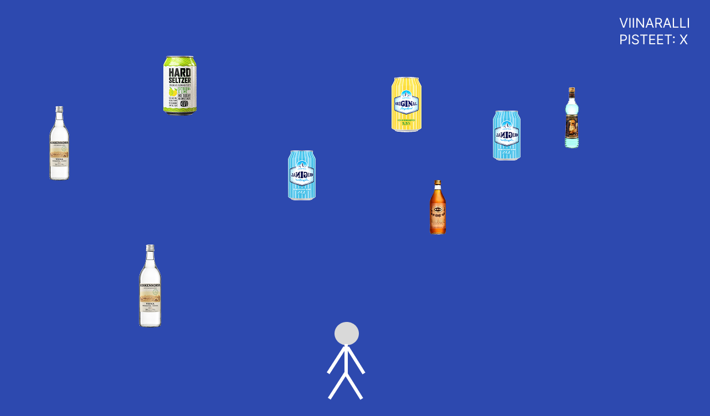

# Harjoitustyön suunnitelma

## Tietoja 

Tekijä: Veeti Sjögrén

Työ git-varaston osoite: <https://github.com/SjogrenDev/ohj1ht>

Pelin nimi: Viinaralli

Pelialusta: Windows/macOS

Pelaajien lukumäärä: 1

## Pelin tarina

Pelissä yritetään selvitä Jyväskylän yöelämässä väistelemällä väkeviä alkoholijuomia. 

## Pelin idea ja tavoitteet

Pelin ideana on pelaajalla osua vain mietoihin alkoholijuomiin. Väkevät alkoholijuomat aloittavat pelin alusta. Pelin tavoitteena on kerätä mahdollisimman paljon pisteitä "juomalla" mietoja juomia.

## Hahmotelma pelistä

## Toteutuksen suunnitelma

Helmikuu

- Pelikenttä
- Pelin grafiikat

Maaliskuu

- Pelin logiikka
- Pistelaskuri

Jos aikaa jää

- Efektit väkevistä juomista
- Kerättävät esineet?